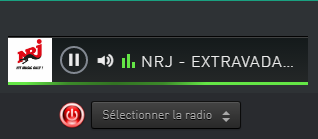

# WebRadio [radio.fr]

Ce plugin est un add-on pour le framework [Avatar](https://github.com/Spikharpax/Avatar-Serveur-3.0).

***
## ★ A savoir
Le plugin webradio vous permet de lancer vocalement une radio et d'afficher le player sur l'interface du serveur, vous pouvez également changer de radio via une liste déroulante, ou a partir de l'icone.

***
## ★ Installation
* Téléchargez le projet depuis la bibliothèque de plug-ins A.V.A.T.A.R

***
## ★ Configuration et utilisation
* Pour configurer les radios de votre choix, vous devez les ajouter dans le fichier de propriétés. 
* Ex     : 
  
- "eradio": {
-				"NRJ": "nrjfrance",
-				"FUN": "funradio",
-				"FG" : "fg",
-				"RTL": "rtl",
-				"RMC": "rmcinfo"
-               }
La première partie doit être en majuscule, c'est le nom de la radio qui sera affiché dans la liste déroulante du player pour choisir une autre radio via l'interface du serveur. Pour la seconde partie en minuscule, allez sur le site www.radio.fr, recherchez votre radio, ensuite cliquez sur le lien '<>integrer', vous trouverez un attribut nommé 'data-playstation' suivi du nom de la radio, collez le nom de la radio dans le fichier...

* Si vous souhaitez mettre l'icone de la radio correspondante, copiez la dans le dossier /asset/images/radios (18px*18px).

* Vous devez également fournir le no du client qui doit tourner sur le serveur pour que le player s'affiche dans l'interface.

***
## ★ Version
Release 1.0 [01/06/2020]

***
## ★ License
Copyright (c) Eddy TELLIER

  